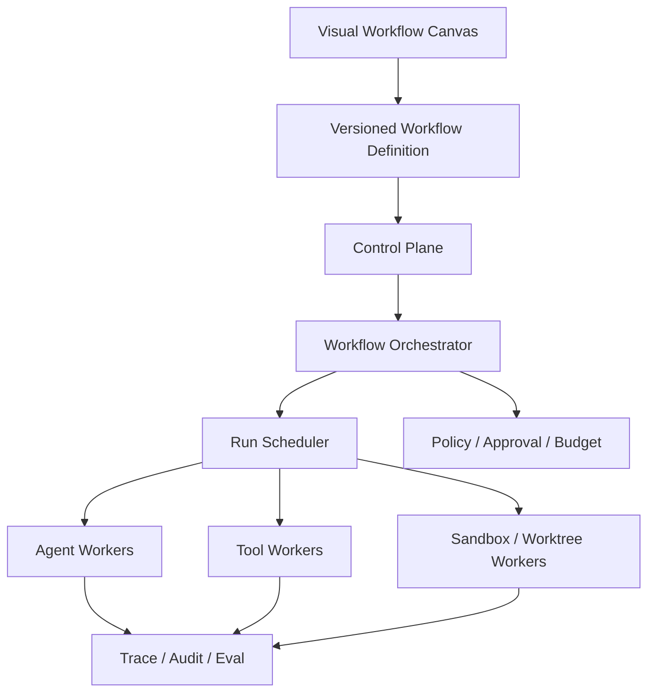

# Agent Hub Evolution Plan

[简体中文](EVOLUTION_PLAN.md) | [English](EVOLUTION_PLAN.en.md)

## 1. Final Model

Agent Hub is ultimately defined as:

> A platform for visually composing Agents, Skills, Tools, Policies, and Human Approvals as building blocks, then reliably running those development workflows in isolated execution environments.

The model follows four principles:

1. **User orchestration first**: the user-defined Workflow is the source of truth.
2. **Deterministic control first**: state, scheduling, retries, approvals, and permissions belong to the platform, not the model.
3. **Definition and execution are separate**: Agent Definition, Agent Run, and Runtime Process are distinct objects.
4. **Dynamic autonomy is optional**: Supervisor/Sub-agent is an advanced building block, not a mandatory root for every Workflow.



## 2. Target Runtime Model

- Product plane: Agent, Skill, Tool, Workflow, Policy, Approval, Template, and Subworkflow building blocks.
- Control plane: Registry, Workflow Orchestrator, Scheduler, and Governance.
- Execution plane: Agent Workers, Tool Workers, Sandbox Workers, Artifact Store, and Trace.

## 3. Phased Roadmap

### Phase 1: Standardize Building-block Contracts (P0)

Goal: make every building block safely and verifiably composable.

Scope:

- Unify version references across Agents, Tools, Skills, and Workflow Nodes.
- Complete input/output JSON Schemas and field mappings.
- Add connection compatibility checks and pre-publish validation.
- Validate Parallel/Join, Condition, Approval, and cycle rules.
- Show model, permission, Tool, Policy, and risk summaries on the canvas.

Exit criteria:

- Incompatible nodes cannot be published.
- All built-in Workflow templates pass static validation.
- Breaking Schema changes are detected during Agent or Tool upgrades.

### Phase 2: Persist Node Runs (P0)

Goal: turn in-process node calls into recoverable tasks.

Scope:

- Add Node Run Schema, Store, and Service.
- Support queued, claimed, running, waiting, succeeded, failed, cancelled, and interrupted states.
- Persist attempts, idempotency keys, input snapshots, output references, Trace, and Audit.
- Define cancellation, failure propagation, and recovery rules.

Exit criteria:

- Incomplete Workflows recover after a Server restart.
- Side-effecting nodes are not duplicated for the same idempotency key.
- The UI displays node state, attempt count, and error details.

### Phase 3: Local Multiprocess Workers (P0)

Goal: move execution out of the Server process without changing user Workflows.

Scope:

- Split Server, Scheduler, and Worker process roles.
- Add a persistent Run Queue.
- Add Worker registration, capability labels, concurrency slots, and heartbeats.
- Implement claim, lease, renew, complete, and lost-worker recovery.
- Execute Agent and Tool Runtimes through Worker handlers.

Exit criteria:

- At least two Workers concurrently consume different Node Runs.
- Leases recover after a Worker is forcibly terminated.
- The Server no longer owns model or Tool child processes directly.

### Phase 4: Real Parallelism and Resource Scheduling (P1)

Goal: make Parallel/Join controlled, genuine parallel execution.

Scope:

- Add Workflow, tenant, Agent, and Worker concurrency limits.
- Add fail-fast, wait-all, and partial-success Join policies.
- Add priority, fair scheduling, resource-label matching, cancellation, timeout, and aggregate budgets.

Exit criteria:

- Parallel branches run simultaneously on separate Workers.
- Every failure policy has deterministic, tested behavior.
- Retries and Subworkflows cannot bypass concurrency or budget limits.

### Phase 5: Worktree, Sandbox, and Network Isolation (P1)

Goal: create real execution boundaries for code changes and external calls.

Scope:

- Allocate an isolated Worktree to code-changing Node Runs.
- Enforce filesystem, command, network, Git-write, resource, and secret policies.
- Resolve an immutable permission snapshot before Worker execution.
- Add Worktree locking, cleanup, retention, conflict handling, and Approval for high-risk writes.

Exit criteria:

- Two Implementation Agents never write to the same working directory.
- Subworkflows and retries cannot escalate permissions.
- Unauthorized network, file, and secret access is rejected before execution.

### Phase 6: Dynamic Supervisor and Sub-agents (P2)

Goal: add governed dynamic delegation inside deterministic Workflows.

Scope:

- Add Supervisor/Delegate Agent nodes.
- Implement `delegate_agent` as a Policy-controlled system Tool.
- Add `rootRunId`, `parentRunId`, `depth`, and delegation reason to Agent Runs.
- Add child-run query, cancellation, messaging, and result aggregation.
- Limit depth, child count, concurrency, cost, and the delegable Agent allowlist.
- Calculate effective permissions as the intersection of parent delegation, child definition, Workflow Policy, and organization Policy.

Exit criteria:

- Ordinary Workflows still run without a Root Agent.
- Dynamic Sub-agents cannot bypass parent permissions or budgets.
- Run Tree traces every delegation, result, and cost.

### Phase 7: Distributed Runtime and Production Governance (P2)

Goal: evolve local multiprocess execution into a multi-host, operable platform.

Scope:

- Replace JSON Stores with pluggable database Stores.
- Introduce a production Queue/Event Bus.
- Add remote Worker identity, authentication, and capability attestation.
- Add tenancy, RBAC, quotas, audit export, and admin APIs.
- Build AutoRaters, Rubrics, and Regression Gates from production Traces.
- Add metrics, alerts, dead-letter queues, and disaster recovery.

Exit criteria:

- Multiple Control Plane instances and remote Workers collaborate safely.
- Worker identity and capabilities are attestable.
- Critical Workflow releases pass regression gates.
- Cost, permissions, and audit history are attributable by tenant.

## 4. Dependencies and Priorities

```text
P0: Phase 1 → Phase 2 → Phase 3
                         ↓
P1:              Phase 4 → Phase 5
                                  ↓
P2:                       Phase 6 → Phase 7
```

| Phase | Priority | Prerequisite | Primary value |
|---|---|---|---|
| Phase 1 | P0 | Current Registry/Canvas | Truly composable building blocks |
| Phase 2 | P0 | Phase 1 | Recoverable and observable execution |
| Phase 3 | P0 | Phase 2 | Multiprocess execution foundation |
| Phase 4 | P1 | Phase 3 | Parallel efficiency and resource control |
| Phase 5 | P1 | Phase 3; preferably Phase 4 | Secure code-execution boundary |
| Phase 6 | P2 | Phases 2, 4, and 5 | Governed dynamic autonomy |
| Phase 7 | P2 | Phases 3, 5, and 6 | Production distributed platform |

## 5. Explicit Non-goals

- Do not require a Root Agent in every Workflow.
- Do not let models manage leases, retries, permissions, or process scheduling.
- Do not permanently bind an Agent Definition to one process.
- Do not grant Sub-agents all parent permissions by default.
- Do not introduce complex distributed infrastructure before Node Run recovery exists.
- Do not let dynamic orchestration replace deterministic user-authored Workflows.

## 6. Immediate Milestone

The next milestone is **Phase 1: Standardize Building-block Contracts**:

1. Define Node Contract v1.
2. Add ports and field mappings.
3. Implement the Workflow pre-publish static checker.
4. Display connection errors, permissions, and risks on the canvas.
5. Add contract regression tests for built-in Workflows.

Keep the current single-process Runtime during Phase 1 so orchestration semantics and execution topology do not change at the same time.
