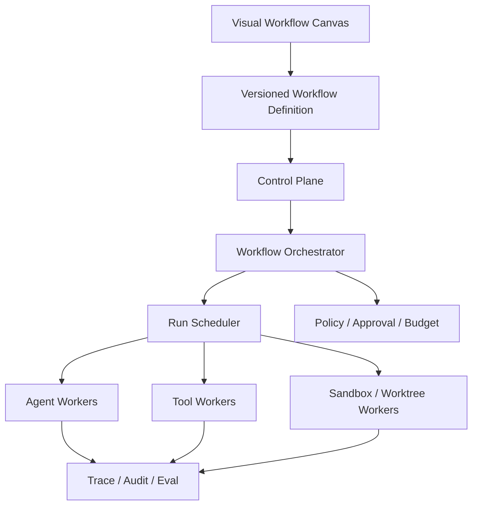

# Agent Hub 演进计划

[简体中文](EVOLUTION_PLAN.md) | [English](EVOLUTION_PLAN.en.md)

## 1. 最终模型

Agent Hub 最终定位为：

> 一个通过可视化积木编排 Agent、Skill、Tool、Policy 和 Human Approval，并在隔离执行环境中可靠运行开发工作流的平台。

最终模型遵循四项原则：

1. **用户编排优先**：用户定义的 Workflow 是流程事实来源。
2. **确定性控制优先**：状态、调度、重试、审批和权限由平台控制，不交给模型决定。
3. **定义与执行分离**：Agent Definition、Agent Run 和 Runtime Process 是不同对象。
4. **动态自治可选**：Supervisor/Sub-agent 是高级积木，不是所有 Workflow 的强制根节点。



## 2. 目标运行模型

### 产品层

- Agent：模型驱动的能力积木。
- Skill：不直接获得权限的可复用方法和知识。
- Tool：确定性的外部能力。
- Workflow：用户编排的版本化 DAG。
- Policy、Approval：流程中的治理积木。
- Template、Subworkflow：可复用开发流程。

### 控制平面

- Registry：管理 Agent、Skill、Tool、Workflow 和 Policy 版本。
- Workflow Orchestrator：解析 DAG、分支、Join、暂停和恢复。
- Scheduler：队列、优先级、租约、并发、超时和重试。
- Governance：权限、预算、审批和审计决策。

### 执行平面

- Agent Worker：执行模型 Runtime Adapter。
- Tool Worker：执行 HTTP、MCP 和本地 Tool。
- Sandbox Worker：提供进程、网络、文件系统和 Worktree 隔离。
- Artifact/Trace：保存执行结果、事件、成本和评估数据。

## 3. 分阶段计划

### Phase 1：积木契约标准化（P0）

实施状态：**进行中**（`feature/node-contract-v1`）。Node Contract v1、静态引用校验、Contract Catalog API、画布风险摘要和发布时资产兼容性检查已经实现。新增领域模块采用严格 TypeScript，并通过 `tsc` 生成 Node 运行产物。

Schema 兼容性检查在后续分支 `feature/schema-compatibility-v1` 继续实现：Agent 和 Tool 发布新版本时会生成 compatibility report，递归识别必填字段、属性、类型、枚举和 additional properties 的破坏性变化。Workflow 发布时会将未指定版本的 Agent、Tool 和子 Workflow 解析并锁定到具体版本，避免运行时因“最新版本”变化而漂移。

目标：确保所有积木能够安全、可验证地连接。

主要工作：

- 统一 Agent、Tool、Skill 和 Workflow Node 的版本引用格式。
- 完善输入输出 JSON Schema 和字段映射。
- 增加画布连线兼容性检查和发布前校验。
- 校验 Parallel/Join、Condition 分支、Approval 和循环规则。
- 在画布显示模型、权限、Tool、Policy 和风险摘要。
- 建立通用错误码及节点执行契约。

交付物：

- Node Contract v1。
- Workflow 静态检查器。
- 画布配置诊断面板。
- 契约兼容性测试。

完成标准：

- 不兼容的节点无法发布。
- 内置 Workflow 模板全部通过静态校验。
- Agent 或 Tool 版本升级能识别破坏性 Schema 变化。

### Phase 2：Node Run 持久化（P0）

实施状态：**进行中**（`feature/node-run-persistence-v1`）。已新增独立 Node Run 数据模型、JSON Store、状态机、幂等创建、Worker claim/lease 基础协议和重启恢复逻辑。现有单进程 Workflow Runtime 在节点开始、输入、等待、成功、失败和取消时同步写入 Node Run，并通过 `GET /api/workflow-runs/:id/node-runs` 与 `GET /api/node-runs/:id` 暴露只读运行时间线。

目标：将 Workflow 节点从进程内函数调用升级为可恢复的任务。

主要工作：

- 新增 Node Run 数据模型和 Store。
- 状态支持 `queued`、`claimed`、`running`、`waiting`、`succeeded`、`failed`、`cancelled`、`interrupted`。
- 增加 attempt、idempotency key、输入快照和输出引用。
- Workflow Run 通过 Node Run 推进，不直接依赖函数调用完成。
- 建立取消传播、失败传播和恢复规则。
- 为状态转换记录 Trace 和 Audit。

交付物：

- Node Run Schema/Store/Service。
- 可恢复的 Workflow 执行状态机。
- Run Tree 和节点时间线 API。

完成标准：

- Server 重启后可以恢复未完成 Workflow。
- 同一个幂等键不会重复执行副作用节点。
- UI 能展示每个节点的状态、尝试次数和错误。

### Phase 3：本地多进程 Worker（P0）

实施状态：**进行中**（`feature/local-worker-runtime-v1`、`feature/worker-node-handlers-v1`）。已新增 Worker Registry、心跳、能力标签、并发槽位、Node Run claim/lease/renew/complete 基础协议、过期 lease 回收和本地 CLI：`agent-hub worker` 与 `agent-hub scheduler`。当前 worker 支持可插拔 handler，并内置 start、condition、end、agent 和 tool 节点处理；Agent 节点复用 Agent Service，Tool 节点复用 Tool Service 与 Policy 检查。

目标：在不改变用户 Workflow 的情况下，将执行移出 Server 进程。

主要工作：

- 拆分 `server`、`scheduler`、`worker` 三种进程角色。
- 建立持久化 Run Queue。
- 实现 Worker 注册、能力标签、并发槽位和心跳。
- 实现 claim/lease/renew/complete 协议。
- Worker 失联后将 Run 标记 interrupted 或安全重排队。
- Agent Runtime 和 Tool Runtime 通过 Worker Handler 执行。

交付物：

- `agent-hub scheduler` 命令。
- `agent-hub worker` 命令。
- Worker/Lease 数据模型。
- 本地多 Worker 开发配置。

完成标准：

- 至少两个 Worker 可并发消费不同 Node Run。
- Worker 被强制终止后，租约能够回收。
- Server 进程不直接持有模型或 Tool 子进程。

### Phase 4：真实并行与资源调度（P1）

实施状态：**进行中**（`feature/scheduler-resource-policy-v1`）。已新增 Node Run scheduling 元数据，支持 priority 和 requiredCapabilities；Worker claim 会根据 capability tags、active slots 和优先级选择 queued Node Run，避免不匹配或已满载的 Worker 抢占任务。

目标：让 Parallel/Join 成为可控的真实并行执行能力。

主要工作：

- 支持 Workflow、租户、Agent 和 Worker 级并发限制。
- 支持 `fail-fast`、`wait-all` 和允许部分成功的 Join 策略。
- 支持优先级、公平调度和资源标签匹配。
- 支持分支取消、超时和预算汇总。
- 在画布和 Run 详情展示并行执行时间线。

交付物：

- 并发与 Join Policy。
- Scheduler 资源匹配器。
- 并行 Trace 视图。

完成标准：

- 并行分支能在不同 Worker 同时运行。
- 任一失败策略均具有确定且可测试的结果。
- 并发和预算上限不会因重试或子流程绕过。

### Phase 5：Worktree、Sandbox 与网络隔离（P1）

实施状态：**进行中**（`feature/worktree-sandbox-boundary-v1`）。已新增 Worktree Lease Service，支持独占锁、释放和过期恢复；Worker 在执行 Node Run 前会解析 sandbox snapshot，并为 isolated/workspace-write/gitWrite 的代码型节点申请 worktree lease，避免多个实现节点写入同一工作目录。

目标：让代码修改和外部调用拥有真实执行边界。

主要工作：

- 为代码型 Node Run 分配独立 Worktree。
- 实现 Sandbox Profile：文件系统、命令、网络、Git 写入和资源限制。
- Worker 启动前解析 Policy，生成不可扩权的权限快照。
- Tool secrets 仅在获准的 Worker/Tool 调用中短暂注入。
- 增加 Worktree 锁、清理、保留和冲突处理。
- 高风险写操作接入 Human Approval。

交付物：

- Sandbox Manager。
- Worktree Lease Service。
- Network/Secret Policy Enforcement。
- 隔离审计报告。

完成标准：

- 两个 Implementation Agent 不会写入同一工作目录。
- Subworkflow 或重试无法提升权限。
- 未授权网络、文件和 Secret 访问在执行前被拒绝。

### Phase 6：动态 Supervisor 与 Sub-agent（P2）

目标：在确定性 Workflow 中增加受治理的动态委派能力。

主要工作：

- 新增 Supervisor/Delegate Agent 节点。
- 将 `delegate_agent` 实现为受 Policy 控制的系统 Tool。
- Agent Run 增加 `rootRunId`、`parentRunId`、`depth` 和委派原因。
- 支持 child run 查询、取消、消息和结果汇总。
- 限制最大深度、子 Agent 数、并发、成本和可委派 Agent allowlist。
- 权限按父级委派、子 Agent 定义、Workflow Policy 和组织 Policy 取交集。

交付物：

- Run Tree。
- Delegation API/System Tool。
- Supervisor 节点和画布配置。
- 委派 Policy 与预算规则。

完成标准：

- 普通 Workflow 无需 Root Agent 仍可完整运行。
- 动态 Sub-agent 不能绕过父流程权限和预算。
- Run Tree 可以追踪每次委派、产出和成本。

### Phase 7：分布式运行与生产治理（P2）

目标：从本地多进程扩展到多主机、可运营的 Agent Hub。

主要工作：

- 将 JSON Store 迁移为可替换的数据库 Store。
- 引入生产级 Queue/Event Bus。
- 支持远程 Worker 身份、认证和 capability attestation。
- 建立租户、RBAC、配额、审计导出和管理 API。
- 基于生产 Trace 建立 AutoRater、Rubric 和 Regression Gate。
- 增加指标、告警、死信队列和灾难恢复。

完成标准：

- 多实例 Control Plane 和远程 Worker 可安全协作。
- Worker 身份及能力可验证。
- 关键 Workflow 发布前必须通过回归门禁。
- 平台能够按租户追踪成本、权限和审计记录。

## 4. 阶段依赖与优先级

```text
P0: Phase 1 → Phase 2 → Phase 3
                         ↓
P1:              Phase 4 → Phase 5
                                  ↓
P2:                       Phase 6 → Phase 7
```

| 阶段 | 优先级 | 前置条件 | 核心价值 |
|---|---|---|---|
| Phase 1 | P0 | 当前 Registry/Canvas | 积木真正可组合 |
| Phase 2 | P0 | Phase 1 | 可恢复、可观测执行 |
| Phase 3 | P0 | Phase 2 | 多进程执行基础 |
| Phase 4 | P1 | Phase 3 | 并行效率与资源控制 |
| Phase 5 | P1 | Phase 3；建议 Phase 4 | 安全的代码执行边界 |
| Phase 6 | P2 | Phase 2、4、5 | 受治理的动态自治 |
| Phase 7 | P2 | Phase 3、5、6 | 生产级分布式平台 |

## 5. 明确不做的设计

- 不强制每个 Workflow 设置 Root Agent。
- 不让模型承担租约、重试、权限和进程调度。
- 不把一个 Agent Definition 永久绑定到一个进程。
- 不允许 Sub-agent 默认继承父 Agent 的全部权限。
- 不在 Node Run 和恢复能力完成前直接引入复杂分布式基础设施。
- 不让动态编排取代用户在画布上定义的确定性流程。

## 6. 当前最近里程碑

当前进入 **Phase 2：Node Run 持久化**。第一批实施任务：

1. 定义独立 Node Run Schema 和 Store。
2. 将 Workflow 节点状态同步到 Node Run。
3. 支持幂等键、attempt、输入快照、输出引用和错误快照。
4. 增加 claim、lease、renew、complete 和 interrupted 恢复语义。
5. 暴露节点运行时间线 API，为 Phase 3 Worker 接管执行做准备。

Phase 2 完成前，先保持当前单进程 Runtime；Phase 3 再把 Node Run Queue 交给独立 worker 消费。
