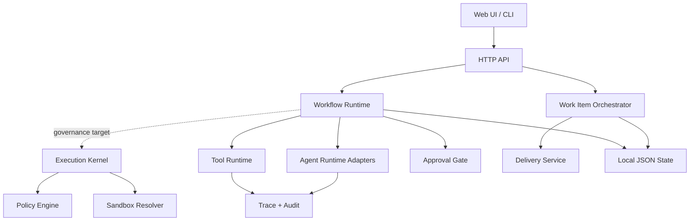

# Technical Design

[简体中文](TECHNICAL_DESIGN.md) | [English](TECHNICAL_DESIGN.en.md)

## Architecture

The diagram describes the target mainline architecture. HTTP Tools already enforce Policy. Uniform Kernel and Sandbox enforcement for Agents, Feature Delivery, and every Workflow node remains in progress.

## Core Objects

Shared TypeScript contracts live under `src/types/`. Runtime Schemas validate external input, while TypeScript types enforce development-time contracts; both must preserve the same field semantics.

Workflows use `contractVersion: 1`. `workflowNodeContract` defines node ports, edge cardinality, risk categories, and cross-node reference checks. `GET /api/workflow-node-contracts` exposes the same runtime contract to the canvas.

`workflowAssetContract` resolves pinned Agent, Tool, and Subworkflow versions at publish time and checks required mappings against their actual input Schemas. New Contract implementations use TypeScript; `prestart` and `pretest` build them before Node loads the generated files from `dist/`.

- Work Item: task identity, source, repository, state, worktree, and artifacts.
- Agent: prompt, schema, provider, skills, tools, permissions, and limits.
- Node Run: one recoverable execution of a Workflow node, including status, attempt, idempotency key, input snapshot, output reference, error, worker lease, and event timeline.
- Skill: reusable instructions and output contract without direct runtime permissions.
- Workflow: a versioned DAG connecting Agents, Tools, conditions, parallel branches, approvals, and delivery.
- Tool: a deterministic external capability whose secrets are referenced through environment variables.
- Policy: deterministic decisions for actions, tools, sandboxes, and approvals.
- Trace: debugging and evaluation data; Audit represents the accountability chain.

## Execution Paths

Agent Run: `validate input → resolve adapter → execute → validate output → persist run → append trace`.

Current Workflow Run: `resolve node → create Node Run → map input → execute node → persist output → choose edge → finish/pause`. The single-process Runtime still performs execution, but node state is mirrored into independent Node Runs so Scheduler and Worker processes can take over later. Tool Nodes perform Policy checks. Uniform Policy and Sandbox enforcement across all nodes is the target mainline.

Work Item: `intake → plan gate → isolated implementation → validation/review → approval → delivery`. This is the current execution path; new capabilities should preferably be composed through Workflow Agent Nodes.

## Persistence

The current implementation uses JSON files under `state/*`, atomic renames, and per-ID serialized writes. Agent Runs, Workflow Runs, and Node Runs are persisted separately. Node Runs are queryable through `GET /api/workflow-runs/:id/node-runs` and `GET /api/node-runs/:id`. This suits local and prototype deployment, but not multi-instance concurrency. Service extraction should replace Store implementations without changing domain Services.

## Security Boundaries

- The server listens on loopback by default; remote binding requires explicit enablement and a Bearer token.
- Sandbox Resolver can reject privilege escalation. Mandatory wiring into every Agent Run remains to be completed.
- External sources and tool output should be marked as untrusted context.
- Provider endpoints, Tool hosts, and secret environment variables must be explicitly declared.
- Git writes, external mutations, and high-risk actions should pass through Approval.

## Extension Points

- Runtime Adapter: add a model or execution environment.
- Source Adapter: integrate GitHub, Linear, Notion, manual input, or an internal system.
- Tool Adapter: connect HTTP, MCP, or local deterministic tools.
- Store Adapter: migrate local JSON to a database or object storage.
- Policy Evaluator: add organization-level roles, risks, and approval rules.

See [Governed Agent OS](governed-agent-os-mainline-design.md) for the complete governance mainline.
