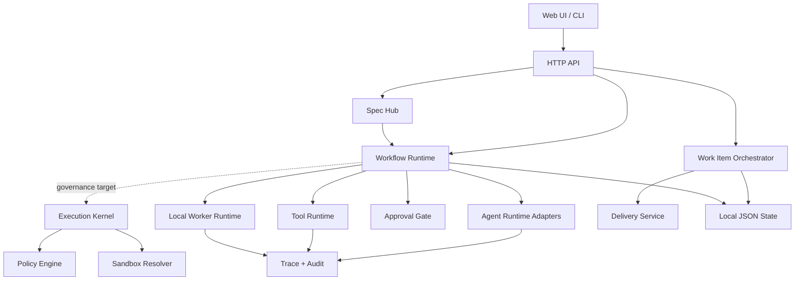

# Technical Design

[简体中文](TECHNICAL_DESIGN.md) | [English](TECHNICAL_DESIGN.en.md)

## Architecture

下图是主线目标结构。当前 HTTP Tool 已接入 Policy；Agent、Feature Delivery 与所有 Workflow Node 的统一 Kernel/Sandbox 强制执行仍在演进中。

## Core objects

公共 TypeScript 契约位于 `src/types/`。运行时 Schema 负责外部输入校验，TypeScript 类型负责开发期约束；两者必须保持相同的字段语义。

Workflow 使用 `contractVersion: 1`。`workflowNodeContract` 提供节点端口、边基数、风险类别和跨节点引用检查，`GET /api/workflow-node-contracts` 向画布暴露同一份运行时契约。

`workflowAssetContract` 在发布时解析固定版本的 Agent、Tool 和 Subworkflow，并根据真实 input Schema 检查必填映射。新增 Contract 实现使用 TypeScript；`prestart` 和 `pretest` 会先执行构建，Node 加载 `dist/` 中的生成文件。

- Work Item：任务身份、来源、repo、状态、worktree 和 artifacts。
- Spec：版本化目标、需求、验收标准、约束和 workflow hints；Published Spec 可以绑定到 Workflow Run。
- Agent：prompt、schema、provider、skills、tools、permissions 和 limits。
- Node Run：Workflow 节点的一次可恢复执行，包含状态、attempt、幂等键、输入快照、输出引用、错误、worker lease 和事件时间线。
- Worker：本地执行进程身份、能力标签、并发槽位、心跳、lease 和活跃 Node Run。
- Skill：可复用方法与输出契约，不直接获得运行权限。
- Workflow：版本化 DAG，把 Agent、Tool、条件、并行、审批和交付连接起来。
- Tool：确定性外部能力，密钥通过环境变量引用。
- Policy：对 action、tool、sandbox 和 approval 作确定性决策。
- Trace：调试与评估数据；Audit 表达责任链。

## Execution paths

Agent Run：`validate input → resolve adapter → execute → validate output → persist run → append trace`。

Workflow Run 当前为：`resolve optional Spec → snapshot Spec → resolve node → create Node Run → map input → execute node → persist output → choose edge → finish/pause`。单进程 Runtime 仍负责完整 Workflow 执行，但 Node Run 已可被本地 Worker claim、lease、renew、complete。`agent-hub worker` 用于消费 queued Node Run，`agent-hub scheduler` 用于回收过期 lease 和 stale worker。Tool Node 会执行 Policy 检查；全节点统一 Policy/Sandbox 是目标主线。

Work Item：`intake → plan gate → isolated implementation → validation/review → approval → delivery`。这是当前执行链；新能力优先通过 Workflow Agent Nodes 组合。

## Persistence

当前使用 `state/*` JSON 文件，并以原子 rename 和按 ID 串行写保护更新。Spec、Agent Run、Workflow Run、Node Run 和 Worker 分别持久化。Workflow Run 可保存 `specId`、`specVersion` 和 `specSnapshot`，用于后续验收证据、trace-based eval 和 compliance report。Node Run 可通过 `GET /api/workflow-runs/:id/node-runs` 和 `GET /api/node-runs/:id` 查询；Worker 可通过 `GET /api/workers` 和 `GET /api/workers/:id` 查询。该实现适合单机和原型，不适合多实例并发。服务化时应替换 Store 实现，而不是修改领域 Service。

## Security boundaries

- 默认只监听 loopback；远程监听需要显式开启和 Bearer token。
- Sandbox Resolver 已能拒绝权限升级；其对全部 Agent Run 的强制接线仍需继续完成。
- 外部 source 和 tool output 应标记为 untrusted context。
- Provider endpoint、Tool host 和 secret env 必须显式声明。
- Git 写入、外部写操作和高风险 action 应进入 Approval。

## Extension points

- Runtime Adapter：新增模型或执行环境。
- Spec Adapter / Planner：从自然语言、模板或外部文档生成版本化 Spec，并推荐 Workflow。
- Source Adapter：接入 GitHub、Linear、Notion、手工输入或内部系统。
- Tool Adapter：HTTP、MCP 或本地确定性工具。
- Store Adapter：从本地 JSON 迁移到数据库或对象存储。
- Policy Evaluator：增加组织级角色、风险和审批规则。

更完整的治理主线见 [Governed Agent OS](governed-agent-os-mainline-design.md)。
