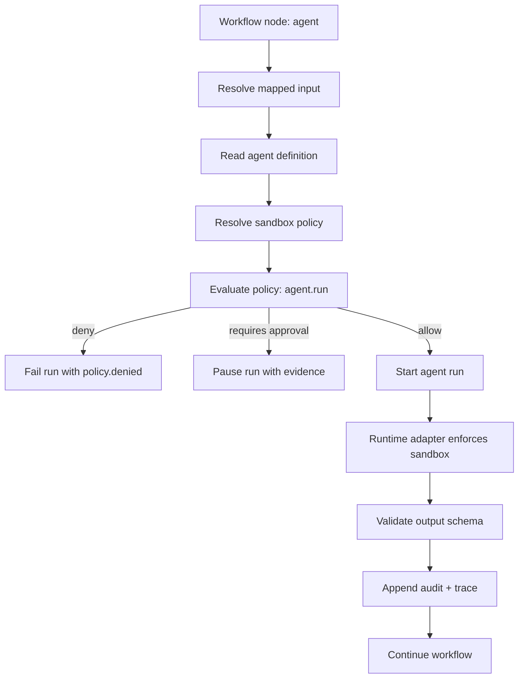
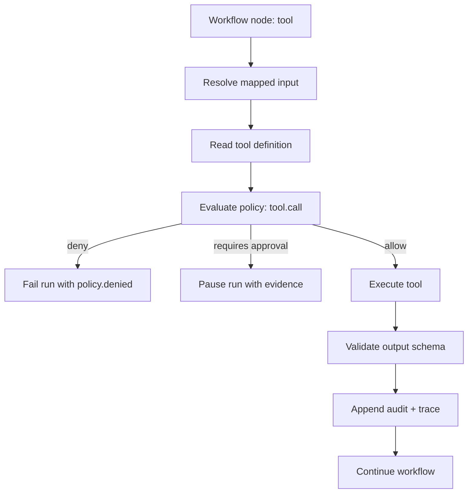
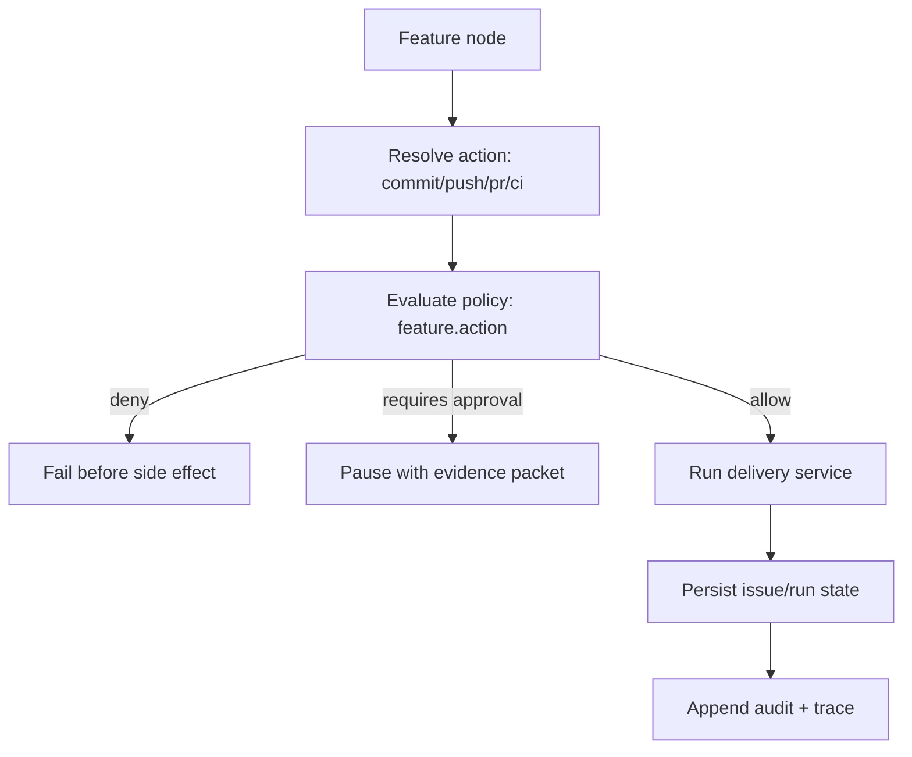

# Governed Agent OS — Mainline Design

Status: Design draft

## One-line architecture

Agent Hub should evolve into a governed Agent OS by making Workflow Runtime the main execution spine, and routing every Agent, Tool, Feature Delivery, Approval, and future MCP/A2A action through Policy, Sandbox, Audit, and Trace.

```text
Workflow Runtime
  -> Policy Engine
  -> Sandbox Resolver
  -> Runtime Adapter
  -> Audit Event
  -> Trace Event
  -> Human Approval when required
```

The most important design choice: do not create a separate security runtime beside the workflow runtime. The workflow runtime is the control plane entry point.

## Current system anchors

The current codebase already has good anchor points:

- `src/workflowService.js`
  - Main orchestration loop.
  - Starts Agent, Tool, Subworkflow, Feature, Approval, Parallel, Join, and End nodes.
  - Owns retries, approval pause/resume, cancellation, idempotency, and failed-node resume.

- `src/agentService.js`
  - Starts individual Agent Runs.
  - Validates input/output schema.
  - Calls the runtime adapter.

- `src/toolService.js`
  - Executes HTTP Tools.
  - Blocks MCP execution until a runtime adapter exists.
  - Enforces HTTPS, allowlisted host, redirect rejection, and secret declaration.

- `src/workflowRunStore.js`
  - Stores run state and append-style run events.
  - Already supports `waiting_approval`.

- `src/agentSchema.js`, `src/toolSchema.js`, `src/workflowSchema.js`
  - Existing validation boundaries for Agent, Tool, and Workflow definitions.

The Phase 8 design should extend these anchors rather than replacing them.

## Mainline modules

### 1. Workflow Runtime Spine

Owner: `src/workflowService.js`

Responsibility:

- Resolve the next node.
- Resolve mapped input.
- Ask Policy Engine whether the action can proceed.
- Ask Sandbox Resolver for the effective runtime boundary.
- Execute Agent/Tool/Feature/Subworkflow.
- Persist audit and trace records.
- Pause for human approval when required.

The workflow runtime should be the only place that can convert a policy result into execution.

### 2. Policy Engine

Owner: `src/policyEngine.js`

Responsibility:

- Accept a normalized action request.
- Resolve applicable policy.
- Produce a deterministic decision:
  - `allow`
  - `deny`
  - `requires_approval`
- Include risk level and reason.
- Never execute side effects.

Canonical request:

```json
{
  "runId": "wrun_123",
  "nodeId": "call-github",
  "subject": {
    "userId": "user_local",
    "agentId": "coder",
    "workflowId": "work-item-planning"
  },
  "action": "tool.call",
  "resource": {
    "type": "tool",
    "id": "github-issue",
    "version": 1
  },
  "context": {
    "sandbox": {},
    "tool": {},
    "inputSummary": {}
  }
}
```

Canonical response:

```json
{
  "effect": "allow",
  "riskLevel": "low",
  "reason": "Tool is allowed by policy.",
  "policyId": "policy_default",
  "policyVersion": 1,
  "requiresApproval": false,
  "decisionId": "decision_123"
}
```

### 3. Sandbox Resolver

Owner: `src/sandboxPolicy.js`

Responsibility:

- Merge policy, agent permissions, workflow settings, and node overrides.
- Prevent privilege escalation.
- Produce runtime-ready sandbox options.

Merge order:

```text
System default deny
  -> Published policy
  -> Agent declared permissions
  -> Workflow/node restrictions
```

Important rule: later layers may reduce privilege, but must not increase privilege beyond the published policy.

Example:

```json
{
  "mode": "isolated-worktree",
  "filesystem": "workspace-write",
  "network": "deny",
  "gitWrite": false,
  "worktreeStrategy": "fresh-per-run",
  "allowedRuntimeTools": ["Read", "Write", "Edit"]
}
```

### 4. Runtime Adapters

Owners:

- `src/runtimes/claudeCodeAgentRuntime.js`
- future `src/runtimes/mcpRuntime.js`
- future native tool adapters

Responsibility:

- Convert resolved sandbox policy into concrete runtime options.
- Enforce adapter-specific restrictions.
- Return structured result.

Runtime adapters should not decide business policy. They should enforce already-resolved policy.

### 5. Tool Runtime Boundary

Owner: `src/toolService.js`

Responsibility:

- Validate tool input/output.
- Refuse execution without policy context, except explicit local test mode.
- Execute HTTP Tools only after policy allow.
- Continue blocking MCP execution until MCP Runtime Adapter exists.
- Redact secrets from errors, audit, and trace.

Tool execution should receive:

```js
executeTool(toolId, input, {
  version,
  policyContext,
  runContext,
  mode: 'workflow' | 'test'
})
```

`mode: 'test'` keeps the current Tool Hub test console usable, but it should be visibly marked as local test execution.

### 6. Approval Gate

Owners:

- `src/workflowService.js`
- `src/workflowRunStore.js`
- `public/app.js`

Responsibility:

- Pause the workflow when Policy Engine returns `requires_approval`.
- Persist requested action and evidence packet.
- Resume exactly the approved action.
- Prevent generic approval reuse for another action.

Current approval nodes are explicit workflow steps. Phase 8 adds policy-triggered approvals.

Both should share the same run status:

```text
waiting_approval
```

But the approval metadata should distinguish:

```json
{
  "approvalKind": "workflow-node | policy-action",
  "requestedAction": "github.pr.create",
  "riskLevel": "high",
  "policyDecisionId": "decision_123"
}
```

### 7. Audit Event Normalizer

Owner: `src/auditEvent.js`

Responsibility:

- Keep audit events consistent.
- Avoid ad-hoc event shapes.
- Redact secrets.
- Provide append helpers.

Audit events answer: “What happened and who is accountable?”

Examples:

- `policy.evaluated`
- `policy.denied`
- `policy.requires_approval`
- `sandbox.resolved`
- `tool.call.allowed`
- `tool.call.denied`
- `approval.requested`
- `approval.granted`
- `approval.rejected`
- `trace.recorded`

### 8. Trace Store

Owner: `src/traceStore.js`

Responsibility:

- Store structured runtime traces by workflow run.
- Prepare for future replay and AutoRaters.
- Use references for large or sensitive payloads.

Traces answer: “How did the agent perform?”

Audit is accountability. Trace is evaluation substrate.

## Main execution flow

### Agent node



### Tool node



### Feature delivery action



## Policy action taxonomy

Use a small action taxonomy. Avoid coupling policy to implementation details.

| Action | Example resource | Default risk |
|---|---|---|
| `agent.run` | `agent.coder@1` | medium |
| `tool.call` | `tool.github-issue@1` | from tool metadata |
| `mcp.call` | `mcp.issue_tracker.update` | from attestation |
| `git.commit` | issue branch | high |
| `git.push` | origin branch | high |
| `github.pr.create` | repository | high |
| `workflow.run` | subworkflow | medium |
| `secret.bind` | `$env.GITHUB_TOKEN` | high |
| `deploy.production` | production env | critical |

Risk can be raised by:

- write side effects
- secret binding
- external network
- production resource
- broad data class
- missing attestation
- node override attempt
- prompt-injection risk flag

## Prompt injection defense mainline

Prompt injection defense should not be a one-off prompt string. It should be built into context ingestion.

Design:

```text
External source
  -> Source classifier
  -> Untrusted context wrapper
  -> Agent runtime input builder
  -> Tool/action policy still enforced
```

Sources treated as untrusted:

- External issue descriptions and comments
- Confluence content
- Figma content
- GitHub issues, PR descriptions, comments
- HTTP Tool output
- MCP Tool output
- pasted user-provided external snippets unless explicitly marked trusted

Important distinction:

- System/developer/workflow instructions are trusted instructions.
- Retrieved content is untrusted data.
- Agent output is untrusted until validated by schema, tests, review, and policy.

## MCP capability mainline

MCP should enter through Tool Hub, not bypass it.

```text
MCP Server capability
  -> Tool Hub MCP definition
  -> Attestation metadata
  -> Policy Engine
  -> MCP Runtime Adapter
  -> Audit + Trace
```

No workflow should call an MCP server directly. It should call a Tool Hub capability that references MCP.

This keeps MCP governed the same way as HTTP Tools.

## A2A future compatibility

Phase 8 should leave room for A2A, but not implement it yet.

Future A2A should look like a governed workflow action:

```json
{
  "action": "agent.handoff",
  "fromAgent": "requirement-analyst",
  "toAgent": "coder",
  "contextRefs": ["trace://run/wrun_123/node/plan"],
  "allowedTools": ["npm.test"],
  "policyId": "policy_coding_default"
}
```

An agent handoff is not permission transfer. The receiving agent gets its own policy evaluation.

## State ownership

| State | Owner |
|---|---|
| Policy definitions | `policyStore` |
| Policy decisions | Workflow run events, optionally indexed later |
| Sandbox decision | Workflow run node metadata |
| Approval packet | Workflow run current approval metadata |
| Audit events | Workflow run events via `auditEvent` helper |
| Trace records | `traceStore` |
| Agent run logs | existing Agent Run store/logs |
| Tool definitions | existing Tool Store |
| MCP attestation | Tool definition metadata |

## API surface

Initial API should be minimal:

```text
GET    /api/policies
POST   /api/policies
GET    /api/policies/:id
PATCH  /api/policies/:id
POST   /api/policies/:id/publish
POST   /api/policies/:id/archive

GET    /api/workflow-runs/:id/audit
GET    /api/workflow-runs/:id/traces
```

Existing run endpoints remain:

```text
POST /api/workflow-runs/:id/approval
POST /api/workflow-runs/:id/retry
POST /api/workflow-runs/:id/resume
POST /api/workflow-runs/:id/cancel
```

The approval endpoint should accept both explicit workflow-node approvals and policy-action approvals.

## UI mainline

Add one new top-level workspace:

```text
Policies
```

Minimum UI:

- Policy list.
- Policy editor.
- Sandbox settings section.
- Allowed tools/actions section.
- Approval-required actions section.
- Prompt-injection guardrails section.
- Published/draft/archive lifecycle.

Workflow Run detail should show:

- Current sandbox.
- Policy decisions.
- Risk badges.
- Approval evidence.
- Trace timeline.

Avoid making the first UI too clever. The main value is visibility and explainability.

## Rollout sequence

### Step 1 — Policy model

Add schema and store only.

No runtime behavior changes yet.

Deliverables:

- `policySchema`
- `policyStore`
- tests
- seed/default policies

### Step 2 — Policy engine

Add deterministic allow/deny/approval decisions.

Deliverables:

- `policyEngine`
- risk classifier
- policy decision tests

### Step 3 — Audit/trace foundation

Normalize audit events and add trace store.

Deliverables:

- `auditEvent`
- `traceStore`
- run trace endpoint

### Step 4 — Tool enforcement

Put Tool calls behind Policy Engine.

Deliverables:

- policy-aware `executeTool`
- workflow tool-node enforcement
- policy-triggered approval for tool calls

### Step 5 — Agent sandbox resolution

Put Agent runs behind Sandbox Resolver and Policy Engine.

Deliverables:

- `sandboxPolicy`
- runtime adapter policy options
- agent-node audit/trace

### Step 6 — Feature delivery gates

Put commit/push/PR/CI actions behind policy.

Deliverables:

- feature action taxonomy
- approval evidence packet
- side-effect-before-approval prevention

### Step 7 — MCP attestation publish rules

Require attestation metadata before publishing MCP Tools.

Deliverables:

- extended `toolSchema`
- MCP attestation validation
- risk classification

### Step 8 — Policy UI

Expose policy and risk to the user.

Deliverables:

- Policies workspace
- run policy timeline
- approval evidence UI

## Design invariants

- No side effect before policy decision.
- No high-risk side effect before required approval.
- No tool secret in agent prompt, audit event, trace record, or UI.
- No MCP capability execution without Tool Hub registration.
- No node-level privilege escalation.
- No agent-to-agent permission transfer.
- No published policy mutation.
- No opaque policy failure; every deny needs a reason.

## Practical first defaults

Start with local single-user identity:

```json
{
  "userId": "user_local",
  "roles": ["admin", "builder", "approver"]
}
```

This avoids blocking Phase 8 on RBAC. Phase 9 can replace it with real users and roles.

Start with default policies:

- `policy_requirement_analyst_default`
- `policy_coding_agent_default`
- `policy_security_reviewer_default`
- `policy_delivery_default`

Each policy should be visible and editable as draft, then publishable.

## Open design questions

1. Should a workflow bind exactly one policy, or can each node bind a policy?
   - Recommendation: workflow-level default policy plus node-level restrictions only.

2. Should Tool Hub test console require policy?
   - Recommendation: allow explicit `mode: test`, but log it separately and block production secrets unless configured.

3. Should CI waiting be considered high risk?
   - Recommendation: no. CI wait is read/poll behavior. PR creation and push are high risk.

4. Should HTTP POST always be high risk?
   - Recommendation: default medium; high if tool declares write side effect, secret use, or external mutation.

5. Should prompt-injection detection block content?
   - Recommendation: not in v1. Wrap and label content structurally; block actions through policy, not text classification alone.

## Success criteria

Phase 8 mainline is successful when a user can inspect any workflow run and answer:

- What policy applied?
- What sandbox was resolved?
- Which actions were allowed or denied?
- Which actions required approval?
- Who approved them?
- Which tools were called?
- Which external content was treated as untrusted?
- What trace can be replayed or evaluated later?

That is the minimum credible foundation for a governed Agent Operating System.
